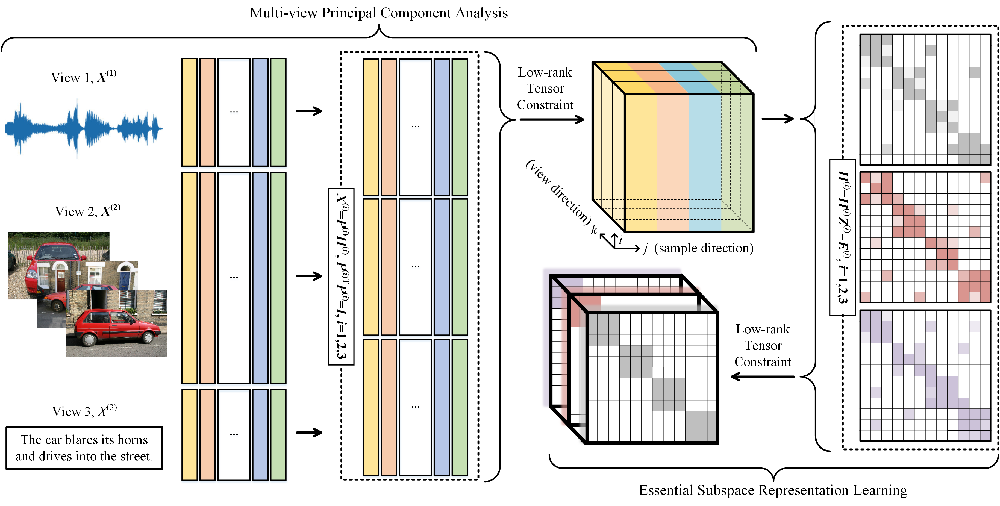

# MSCVC
Source codes of the work "Multi-view Subspace Clustering with View Correlations via low-rank tensor learning" published in CAEE 2022

The demo files (including corresponding datasets) of BBCSports and NGs are included in this repository. We run the demo on MATLAB R2018a on a personal computer with the 11-th Gen 2.70 GHz Intel Core i5-11400H and 16 GB RAM.

If you find this repository useful in your research, please cite our work as follows, thanks.

@article\{MSCVC, 
      &nbsp;&nbsp;&nbsp;&nbsp;title=\{Multi-view Subspace Clustering with View Correlations via low-rank tensor learning\}, 
      &nbsp;&nbsp;&nbsp;&nbsp;author=\{Zheng, Qinghai and Zhu, Jihua\}, 
      &nbsp;&nbsp;&nbsp;&nbsp;journal=\{Computers and Electrical Engineering\}, 
      &nbsp;&nbsp;&nbsp;&nbsp;volume=\{100\}, 
      &nbsp;&nbsp;&nbsp;&nbsp;pages=\{107939\}, 
      &nbsp;&nbsp;&nbsp;&nbsp;year=\{2022\}, 
      &nbsp;&nbsp;&nbsp;&nbsp;publisher=\{Elsevier\} 
\} 

Email: qhxjtu@163.com
